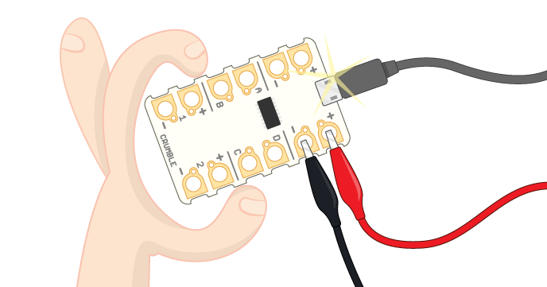

# getting-started-crumble

Find the project online at [projects.raspberrypi.org/en/projects/getting-started-crumble](https://projects.raspberrypi.org/en/projects/getting-started-crumble)

## Resources
For solutions and project materials, see [en/resources](https://github.com/raspberrypilearning/getting-started-crumble/tree/master/en/resources)

## Contributing
See [CONTRIBUTING.md](CONTRIBUTING.md)

## Licence
 See [LICENSE.md](LICENSE.md)