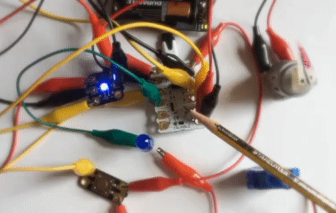
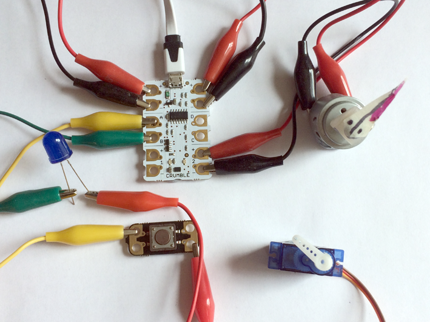

## Introduction

A crumble controller is a very low-cost electronics controller that connects to a computer using a USB cable. Components like LEDs, switches, motors and servos can be connected using crocodile leads and can be programmed using Crumble’s free software.

### What you will make

In this first Crumble project you will learn to setup a Crumble controller, connect a range of common physical computing components such as motors and LEDs, and write simple Crumble codes to make each of them work.

--- no-print ---

--- /no-print ---

--- print-only ---

--- /print-only ---

--- collapse ---
---
title: What you will need
---
### Hardware

+ A PC, Mac or Chromebook with Crumble software installed and a USB port
+ A Crumble starter kit - or the components bought separately
+ A position servo with jumper cables or a Crumbliser
+ A DC motor (3v to 6v)
+ An LED

Don't worry if you don't have some of these components. As long as you have a computer and a Crumble you can just skip the sections where you are missing items. All the other sections will still work fine and all the components are widely available and inexpensive.

### Software

+ [Crumble software](https://redfernelectronics.co.uk/crumble-software/){:target="_blank"}.

### Downloads

+ [rpf.io/getting-started-crumble](http://rpf.io/getting-started-crumble-go){:target="_blank"}

--- /collapse ---

--- collapse ---
---
title: What you will learn
---

+ How to set up a Crumble controller and software
+ How to connect a range of common physical computing components to a Crumble
+ How to write and run code for each component using the Crumble software

--- /collapse ---

--- collapse ---
---
title: Additional information for educators
---

If you need to print this project, please use the [printer-friendly version](https://projects.raspberrypi.org/en/projects/getting-started-crumble/print){:target="_blank"}.

[Here is a link to the resources for this project](http://rpf.io/getting-started-crumble-go).

--- /collapse ---
