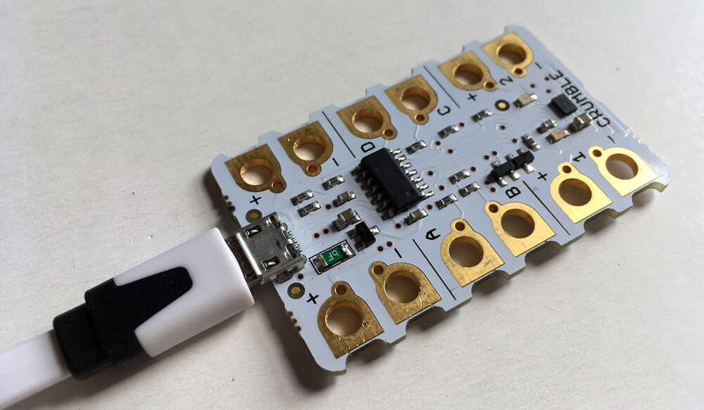

## Connecting the Crumble controller

The first thing to do is to connect your Crumble controller board (the white circuit board with 12 gold terminal holes) to your computer.

--- task ---

Plug the smaller, micro USB, end of your connecting cable into the micro USB socket at one end of your Crumble.



--- /task ---


[google](https://www.google.com){:target="_blank"}

```python
print bye world
```

You'll notice we used the `print` statement

```blocks3
when flag clicked
say [Hello] for (2) secs
```
[[[connecting-crumble]]]
