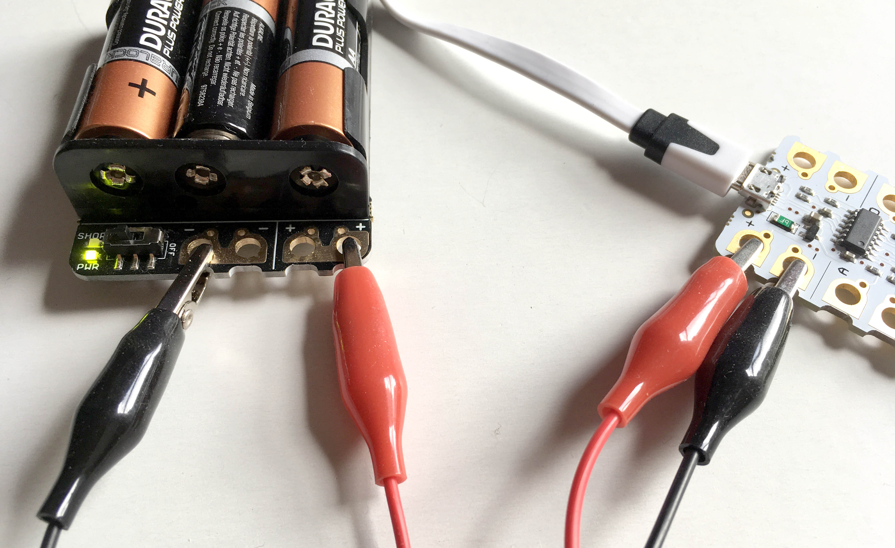
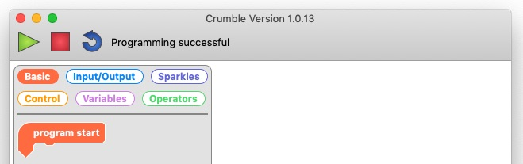

## Setting up the Crumble controller

The Crumble controller board uses a custom-made blockly programming language that you will need installed on your PC, Mac, Chromebook or Linux device. 

[[[installing-crumble-software-mac]]]

`A SLECTION OF INGREDIENTS TO BE CREATED AND PUT HERE FOR EACH DIFFERENT PLATFORM`{:class="crumblesparkles"}

Once you have the Crumble software installed, the next thing to do is to connect your Crumble controller board (the white circuit board with 12 gold terminal holes) to your computer.

--- task ---

Plug the smaller, micro USB, end of your connecting cable into the micro USB socket at one end of your Crumble.

Make sure the connector is the right way round. The slightly flatter side should be facing up.

--- /task ---

--- task ---

Plug the larger, standard USB, end of the cable into a spare USB port on your computer.

NOTE: If this is the first time a Crumble has been plugged into this computer, it may take a minute for the computer to be ready to connect with it properly.
If you do not get any connection try a different USB port.

--- /task ---

After that, we need to connect power to the Crumble. This will supply power to the Crumble when it is not plugged in to your computer and also power any components that we attach.

--- task ---

The Crumble starter kit comes with a fantastic 3xAA battery box with an on/off switch and crocodile-friendly output connections.

Connect crocodile clips to the positive (shown with a '+' symbol) and negative (shown with a '-' symbol) outputs of the battery box and connect these to the positive and negative terminals (the gold coloured holes) on the left side of the Crumble controller.

I have used a red wire for the positive connection and a black wire for the negative connection. This makes it very easy to see what each wire is doing but any colour wire will work just the same.

--- /task ---

That's it. Your Crumble is set up and ready to go. Let's just check that your computer agrees.

--- task ---

Open the Crumble software on your computer and click on the green triangle 'play' button. Normally this runs your code but we are using it to check that your computer is communicating with the Crumble.

If everything is good, you will get the message, "programming successful".

--- /task ---
