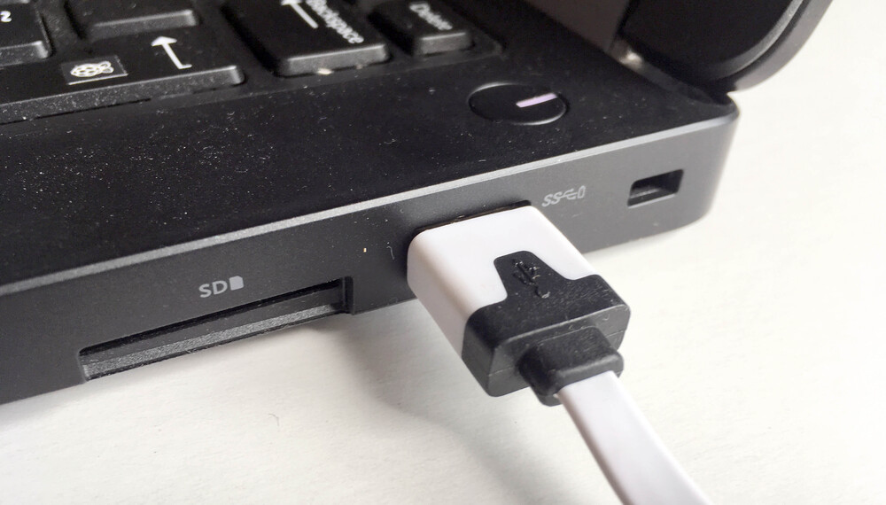

## Setting up the Crumble controller

The first thing to do is to connect your Crumble controller board (the white circuit board with 12 gold terminal holes) to your computer.

--- task ---

Plug the smaller, micro USB, end of your connecting cable into the micro USB socket at one end of your Crumble.

Make sure the connector is the right way round. The slightly flatter side should be facing up.


--- /task ---

Next, we need to connect power to the Crumble. This will supply power to the Crumble when it is not plugged in to your computer and also power any components that we attach.

--- task ---

The Crumble starter kit comes with a 3xAA battery box with a switch and crocodile-friendly output connections.

Connect crocodile clips to the positive (shown with a '+' symbol) and negative (shown with a '-' symbol) outputs of the battery box and connect these to the positive and negative terminals (in this case, the gold coloured holes) on the left side of the Crumble controller.



I have used a red wire for the positive connection and a black wire for the negative connection. This makes it very easy to see what each wire is doing but any colour wire will work just the same.

--- /task ---

--- task ---


--- /task ---
[google](https://www.google.com){:target="_blank"}

```python
print bye world
```

You'll notice we used the `print` statement

```blocks3
when flag clicked
say [Hello] for (2) secs
```
[[[connecting-crumble]]]
