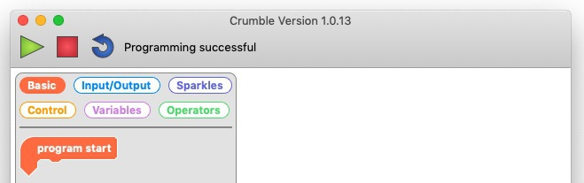

## Set up the Crumble controller

### Crumble software

The Crumble controller board uses a custom-made Blockly programming language that you need to install on your computer. 

[[[installing-crumble-software-windows-os]]]

[[[installing-crumble-software-mac]]]

Crumble is also available for:
+ Chromebooks, currently as a beta version from the Chrome Web Store
+ Linux devices — check the installation instruction on the [Crumble software download page](https://redfernelectronics.co.uk/crumble-software/){:target="_blank"}

### Crumble hardware

After the Crumble software is installed, you connect your Crumble controller board (the white circuit board with 12 gold terminal holes) to your computer.

--- task ---

Plug the smaller end of your connecting cable into the micro USB socket that's at one end of your Crumble.

Make sure the connector is the right way round. The slightly flatter side should be facing up.

--- /task ---

--- task ---

Plug the larger end of the cable into a spare USB port on your computer.

**NOTE:** If this is the first time a Crumble is plugged into your computer, it may take a minute for the computer to connect with it properly.

If you do not get any connection, try a different USB port.

--- /task ---

Next, you connect a power source to the Crumble. This will power to the Crumble while the Crumble isn't plugged in to your computer,

--- task ---

The Crumble starter kit includes a 3×AA battery box with an on/off switch and crocodile clip-friendly output connections.

* Take a cable with crocodile clips. Connect one crocodile clip to a positive output (labeled with a **+** symbol) of the battery box, and connect the crocodile clip at the other end of the cable to the positive terminal of the Crumble (the gold-coloured hole labeled with a **+** symbol).

* Take a second cable with crocodile clips. Connect one of its clips to a negative output (labeled with a **-** symbol) of the battery box, and connect the crocodile clip at the other end of the cable to the negative terminal of the Crumble (the gold-coloured hole labeled with a **-** symbol).

In the images here, there is a red cable for the positive connection and a black cable for the negative connection. This makes it very easy to see what each wire is doing. But you can use any colour of cable you like.

--- /task ---

Finally, check that your computer can talk to the Crumble controller.

--- task ---

Open the Crumble software, and click on the green triangle, which is the **play** button. Normally clicking this button runs any code you add. Because you don't have any code yet, clicking on the button checks that your computer can talk to the Crumble.

If everything is working, you get the message "Programming successful".

--- /task ---

Now your Crumble is set up and ready to use!