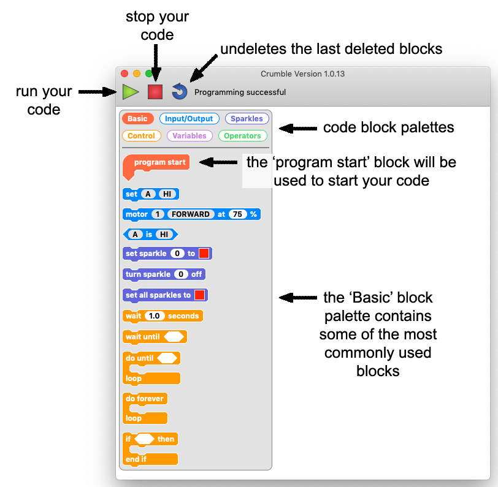
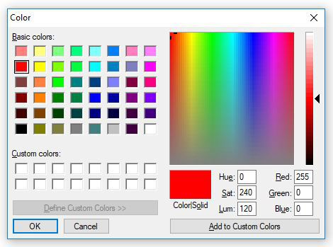
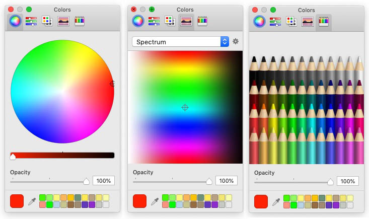
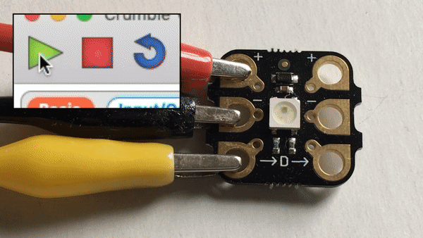
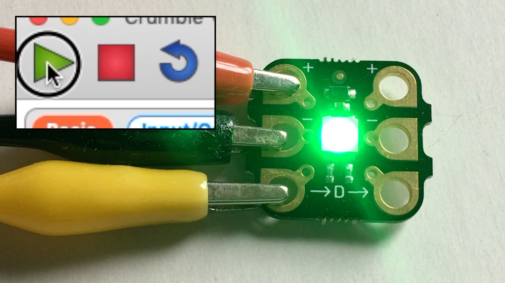

## Crumble Sparkles

Crumble Sparkles are RGB LEDs made specially to be used with the Crumble controller.

The RGB stands for red, green and blue. Using the Crumble software, we can set different levels red, green and blue to display any of nearly 17 million colours!

Before we can do that, we need to connect a Sparkle to our Crumble.

The Sparkle will connect to the positive (+), negative (-) and 'D' terminals on the Crumble controller.

Let's start with the positive.

--- task ---

Use a crocodile clip to connect from the positive output (+) on the right side of the Crumble to the positive input (+) on the left side of the Sparkle.

--- /task ---

Now let's do the same for the negative connection.

--- task ---

Use another crocodile clip to connect from the negative output (-) on the right side of the Crumble to the negative input (-) on the left side of the Sparkle.

--- /task ---

And finally, we make the signal connection which must always be to the 'D' terminal on the Crumble. Sparkles will not work if connected to any other terminal.

The positive and negative cables supply power to the Sparkle but it is this signal connections that will tell the Sparkle what colour it should be.

--- task ---

Use a final crocodile clip to connect from the 'D' terminal on the right side of the Crumble to the ->D-> input on the left side of the Sparkle.

--- /task ---

Great! Our Sparkle is fully connected and it is time to light the lights!

### Your first Crumble code

Before we code, lets have a quick look at the Crumble software programming environment.

It is a blockly language a little like Scratch but in Crumble there are only six block palettes and only one starting block, the 'program start' block.

Let's start coding!

--- task ---

Drag the `program start`{:class="crumblebasic"} block into your workspace.

--- /task ---

Everything that you connect underneath the `program start`{:class="crumblebasic"} block will run.

Any blocks in your workspace that are not connected to the `program start`{:class="crumblebasic"} block will not run.

--- task ---

Click on the `Sparkles`{:class="crumblesparkles"} palette to have a look at what Sparkle coding blocks we can use.

--- /task ---

There are three different types of Sparkle block that we can use.

`set sparkle to`{:class="crumblesparkles"} with a colour picker box, `turn sparkle off`{:class="crumblesparkles"}, and `set sparkle to`{:class="crumblesparkles"} a colour by giving individual red, green and blue values.

Each of these has a version for a specific Sparkle and another for ALL Sparkles!

--- task ---

Drag a `set sparkle to`{:class="crumblesparkles"} block with a colour picker box out into your workspace and join it underneath your `program start`{:class="crumblebasic"} block.

--- /task ---

--- task ---

Click on the colour picker box (this is always red by default) and a colour picker will appear.

Choose a colour for your Sparkle by clicking in the large square colour selector or picking one of the 'Basic colours'.

--- /task ---

On different devices, the colour picker is quite different.

On a Mac for example, there are five different colour picker options!

Here are three of the different ways that you can colour pick using the Mac OSX version of Crumble.

We've got our `program start`{:class="crumblebasic"} block, we've `set sparkle to`{:class="crumblesparkles"} a colour of our choice. That's it, we are ready to run our code!

--- task ---

Press the green 'play' triangle to run your code.

--- no-print ---

--- /no-print ---

--- print-only ---

--- /print-only ---

--- /task ---