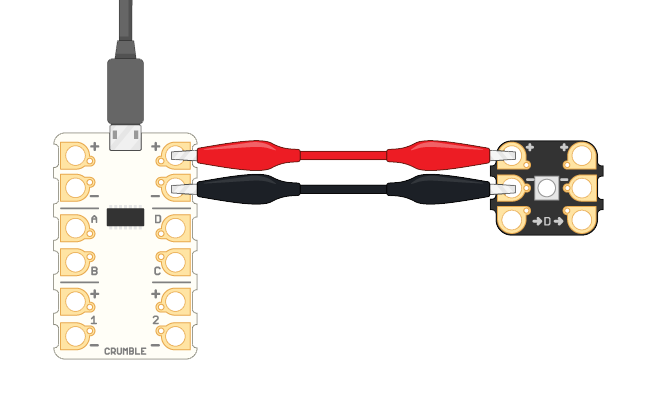
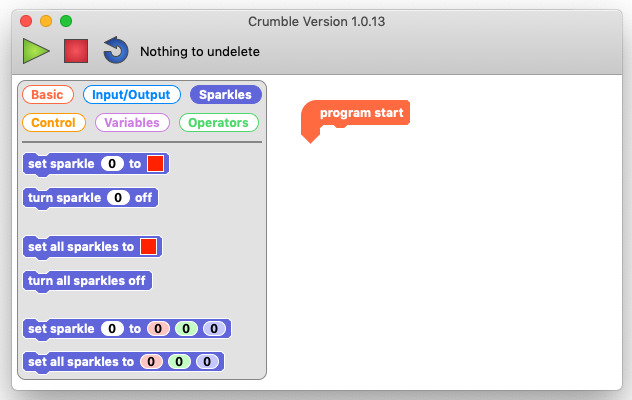

## Use a Crumble Sparkle

Crumble Sparkles are RGB lights made specially for the Crumble controller.

RGB stands for red, green, and blue. Using the Crumble software, you can set different levels of red, green, and blue for the Crumble Sparkle lights. In this way, you can create any of nearly 17 million colours!

To do that, you need to  connect a Sparkle to your Crumble in the right way.

The Sparkle connects to the positive (**+**), negative (**-**), and **D** terminals on the Crumble controller.

Start by connecting the positive terminal.

--- task ---

Look at the Sparkle to see which way the two small arrows are pointing. The side the arrows are pointing to is the **right** side.

Use a cable with crocodile clips to connect the positive terminal (+) on the **right** side of the Crumble to the positive input (+) on the **left** side of the Sparkle.

--- /task ---

Now connect the negative terminal of the Crumble.

--- task ---

Use another cable with crocodile clips to connect the negative output (-) on the **right**side of the Crumble to the negative input (-) on the **left** side of the Sparkle.

--- /task ---

The positive and negative cables supply power to the Sparkle.

And finally, make the signal connection, which tells the Sparkle what colour to light up in. **The signal connection must always be to the D terminal** on the Crumble. Sparkles don't work if you connect them to any other terminal on the Crumble.

--- task ---

Use another cable with crocodile clips to connect the **D** terminal on the **right** side of the Crumble to the **->D->** input on the **left** side of the Sparkle.

--- /task ---

Great! Your Sparkle is now fully connected, and it is time to light it up.

### Your first Crumble program

Have a quick look at the Crumble software programming environment.

It is a little like Scratch, but there are only six types of blocks and only one starting block, which is called the `program start`{:class="crumblebasic"} block.

Let's start coding!

--- task ---

Drag the `program start`{:class="crumblebasic"} block into your workspace.

--- /task ---

Every code block that you connect below the `program start`{:class="crumblebasic"} block is part of your program. Your program runs when you click on the green triangle button.

Any blocks in your workspace that are not connected to the `program start`{:class="crumblebasic"} block are not part of your program.

--- task ---

Click on the `Sparkles`{:class="crumblesparkles"} palette and have a look at the Sparkle coding blocks.

--- /task ---

There are three different types of Sparkle block that you can use:

* `set sparkle to`{:class="crumblesparkles"} with a colour picker box
* `set sparkle to`{:class="crumblesparkles"} with three fields for red, green, and blue values
* `turn sparkle off`{:class="crumblesparkles"}

For each block type, there is a version for a specific Sparkle and another for all Sparkles!

--- task ---

Drag a `set sparkle to`{:class="crumblesparkles"} block with a colour picker box into your workspace, and connect it below the `program start`{:class="crumblebasic"} block.

--- /task ---

--- task ---

Click on the new block's colour picker box (this is always red by default) to make a colour picker appear.

Choose a colour for your Sparkle.

The colour picker looks quite different depending on what computer you are using.

On a Mac for example, there are five different colour picker options! Here are three of the different ways that you can colour-pick using the macOS version of Crumble.

--- /task ---

You now have your `program start`{:class="crumblebasic"} block, and your `set sparkle to`{:class="crumblesparkles"} sets the colour of our choice.

You are ready to run our code!

--- task ---

Click on the green triangle **play** button to run your code.

--- no-print ---

--- /no-print ---

--- print-only ---

--- /print-only ---

--- /task ---