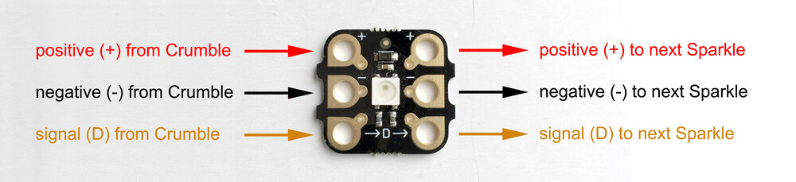
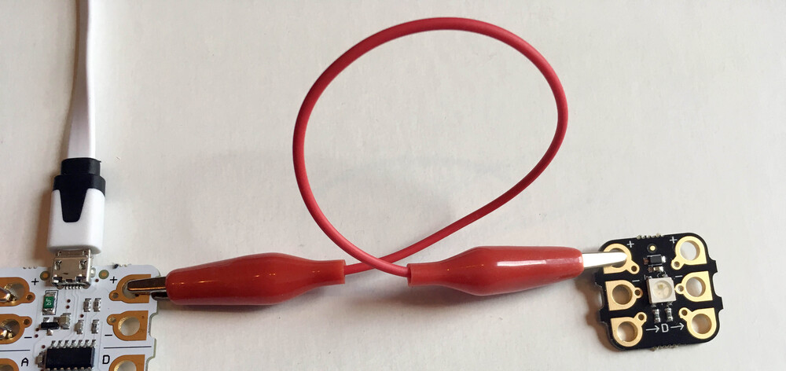

## Connecting a Sparkle

Crumble Sparkles are RGB LEDs made specially to be used with the Crumble controller.

The RGB stands for red, green and blue. Using the Crumble software, we can set different levels red, green and blue to display any of nearly 17 million colours!

Before we can do that, we need to connect a Sparkle to our Crumble.

The Sparkle will connect to the positive (+), negative (-) and 'D' terminals on the Crumble controller.

Let's start with the positive.

--- task ---

Use a crocodile clip to connect from the positive output (+) on the right side of the Crumble to the positive input (+) on the left side of the Sparkle.

--- /task ---

Now let's do the same for the negative connection.

--- task ---

Use another crocodile clip to connect from the negative output (-) on the right side of the Crumble to the negative input (-) on the left side of the Sparkle.

--- /task ---

And last of all, we make the signal connection which must always be to the 'D' terminal on the Crumble. Sparkles will not work if connected to any other terminal.

The positive and negative supply power to the Sparkle but it is this last connections that will tell the Sparkle what colour it should be.

--- task ---

Use a final crocodile clip to connect from the 'D' terminal on the right side of the Crumble to the ->D-> input on the left side of the Sparkle.

--- /task ---

