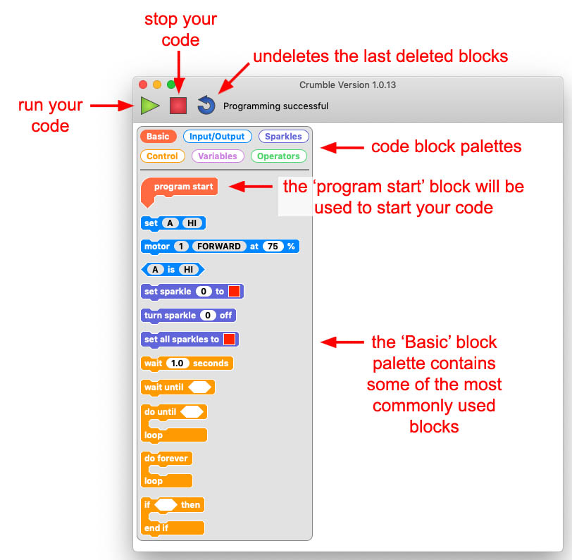
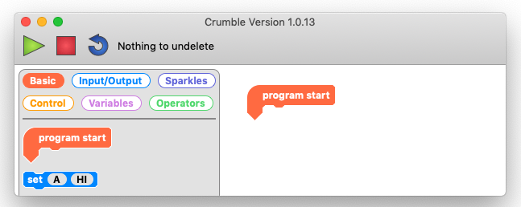
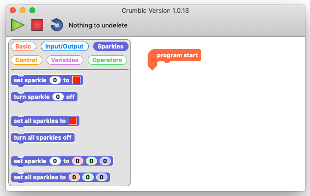
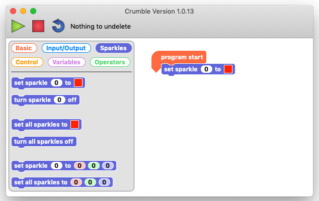

## First Sparkle code

Before we code, lets have a quick look at the Crumble software programming environment.

It is a blockly language a little like Scratch but in Crumble there are only six block palettes and only one starting block, the 'program start' block.

Let's start coding!

--- task ---

Drag the `program start`{:class="block3myblocks"} block into your workspace.

--- /task ---

Everything that you connect underneath the `program start`{:class="block3myblocks"} block will run.

Any blocks in your workspace that are not connected to the `program start`{:class="block3myblocks"} block will not run.

--- task ---

Click on the `Sparkles`{:class="block3looks"} palette to have a look at what Sparkle coding blocks we can use.

--- /task ---

There are three different types of Sparkle block that we can use.

`set sparkle to`{:class="block3looks"} with a colour picker box, `turn sparkle off`{:class="block3looks"}, and `set sparkle to`{:class="block3looks"} a colour by giving individual red, green and blue values.

Each of these has a version for a specific Sparkle and another for ALL Sparkles!

--- task ---

Drag a `set sparkle to`{:class="block3looks"} block with a colour picker box out into your workspace and join it underneath your `program start`{:class="block3myblocks"} block.

--- /task ---

--- task ---

Click on the colour picker box (this is always red by default) and a colour picker will appear.

--- /task ---

