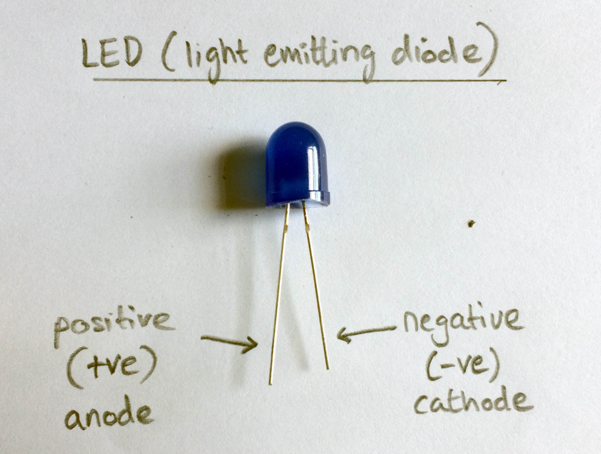

## LEDs

Crumble Sparkles are great but sometimes you may want to just use an ordinary LED or use a mix of Sparkles and LEDs.

LEDs can be connected directly to the Crumble controller board and don't even need battery power while the Crumble is connected to your computer!

LEDs (light emitting diodes) have two legs. The longer leg (anode) must connect to the positive power supply while the shorter leg (cathode) must connect tot he negative or ground. If you get these the wrong way round it will not damage the LED but the LED will not light up.

--- task ---

Use a crocodile clip lead to connect between the Crumble controller's negative output (on the right hand side) and the LED's cathode (shorter, negative leg).

Then connect another crocodile lead between the 'A' terminal on the Crumble and the LED's anode (longer, positive leg).

--- /task ---

That's it! Easy as that! So now we are ready to control the LED with code.

Note: The LED would also work connected to B, C or D terminals but in this example we will just use the A terminal.

--- task ---

Open up the Crumble software and start, as always, with a `program start`{:class="crumblebasic"} block.

To turn the LED on and off we use the `set`{:class="crumbleinputoutput"} block from the `Input/Output`{:class="crumbleinputoutput"} palette.

Drag the `set A HI`{:class="crumbleinputoutput"} block out and connect it under the `program start`{:class="crumblebasic"} block.

--- /task ---

