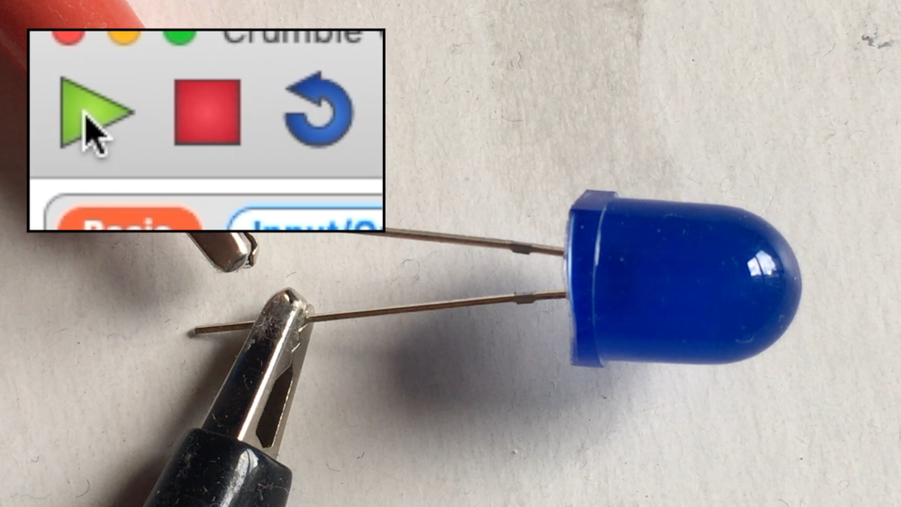

## Use LEDs with your Crumble

Crumble Sparkles are great, but you can also use an ordinary LED (light-emitting diode, basically a small lightbulb) with your Crumble. You could even use a mix of Sparkles and LEDs!

LEDs can be connected directly to the Crumble controller. They don't need battery power while the Crumble is connected to your computer.

LEDs have two legs. The longer leg (called the anode) is positive and must connect to the positive terminal. The shorter leg (called the cathode) must connect to the negative or ground terminal. If you connect the legs the wrong way round, the LED will not light up.

--- task ---

Use a cable with crocodile clips to connect the Crumble controller's negative output (on the right-hand side) to the LED's cathode (the shorter, negative leg).

Then use another cable with crocodile clips to connect the **A** terminal of the Crumble to the LED's anode (the longer, positive leg).

Note: You could also choose to connect the LED to the Crumble's B, C, or D terminal, and the LED would work the same.

--- /task ---

You are now ready to control the LED with code.

--- task ---

Open up the Crumble software and start, as always, with a `program start`{:class="crumblebasic"} block.

Open up the the `Input/Output`{:class="crumbleinputoutput"} blocks menu. You can use the `set`{:class="crumbleinputoutput"} block to turn the LED on and off.

Drag the `set A HI`{:class="crumbleinputoutput"} block out, and connect it below the `program start`{:class="crumblebasic"} block.

Test your code by clicking the green triangle **play** button.

--- no-print ---

--- /no-print ---

--- print-only ---

--- /print-only ---

--- /task ---

Your LED should now be on. Change your code to turn the LED off again.

--- task ---

To turn the LED off, find the `set A HI`{:class="crumbleinputoutput"} block and click on the `HI`{:class="crumbleinputoutput"} field to change it to `LO`{:class="crumbleinputoutput"}.

Notice that clicking on this field switches between `HI`{:class="crumbleinputoutput"} and `LO`{:class="crumbleinputoutput"}.

Test your code by clicking the green triangle **play** button.

--- no-print ---

--- /no-print ---

--- print-only ---

--- /print-only ---

--- /task ---

