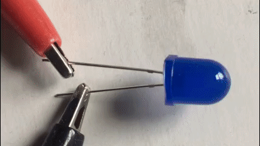
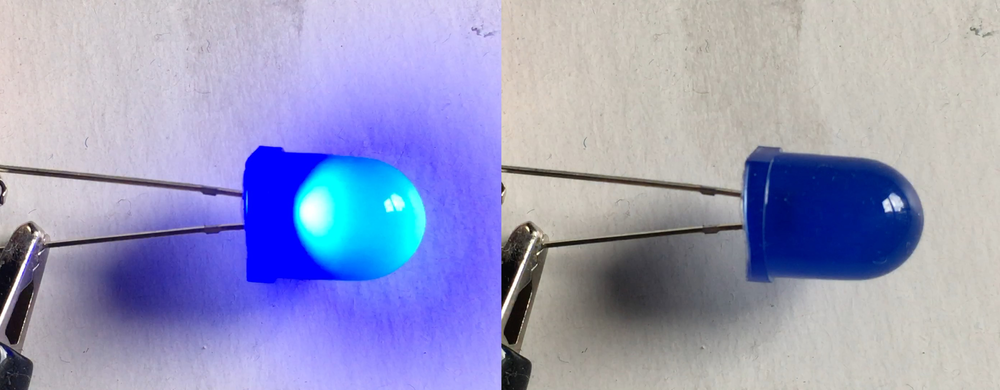
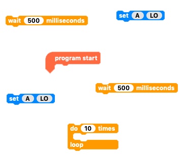
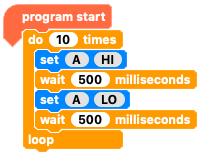

## Challenge: flashing LED

Can you write code that will make your LED flash on and off?

--- no-print ---

--- /no-print ---

--- print-only ---

--- /print-only ---

Think about what the LED is doing in each moment to flash. What instructions do we need to give the LED to make if flash?

--- hints ---

--- hint ---

Use code so that when the `program starts`{:class="crumblebasic"}, the LED `turns on`{:class="crumbleinputoutput"}. Then, `after half a second`{:class="crumblecontrol"}, the LED `turns off`{:class="crumbleinputoutput"}. Once off `wait another half a second`{:class="crumblecontrol"}. To keep flashing, all of that code will need to `repeat`{:class="crumblecontrol"} perhaps ten times or however many you like.

--- /hint ---

--- hint ---

When using repeat loops, remember that the first block in the loop will at some point come right after the last block.

--- /hint ---

--- hint ---

You need a `wait`{:class="crumblecontrol"} after every `on`{:class="crumbleinputoutput"} or `off`{:class="crumbleinputoutput"} block.

--- /hint ---

--- /hints ---