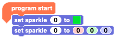

## More Sparkle with RGB colour code

Now that we have one Sparkle working, let's add another one! This time we will use RGB (red, green and blue) values to set our Sparkle's colour.

--- task ---

Our second Sparkle will simply 'daisy chain' onto the first Sparkle. Where we attached croc clips going from the Crumble to the left hand side of the Sparkle, we will now do the same thing going from the right side of the first Sparkle tot he left side of the second Sparkle.

NOTE: Just like before, make sure that you connect positive to positve, negative to negative and signal (D) to signal (D).

--- /task ---

Now we need to add some code to make the second Sparkle turn on.

--- task ---

In the Crumble software on your computer, we're going to try a new block from the Sparkle block palette.

Drag out the `set sparkle to`{:class="block3looks"} block that ends with the three RGB value input boxes, `0`{:class="block3myblocks"} `0`{:class="block3operators"} `0`{:class="block3motion"} and connect it under your existing `set sparkle to`{:class="block3looks"} block.

--- /task ---

--- task ---

--- /task ---

--- task ---

--- /task ---