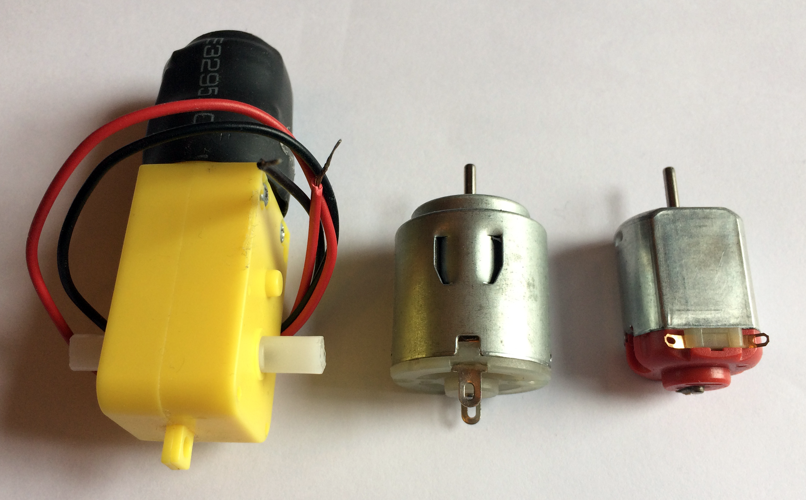
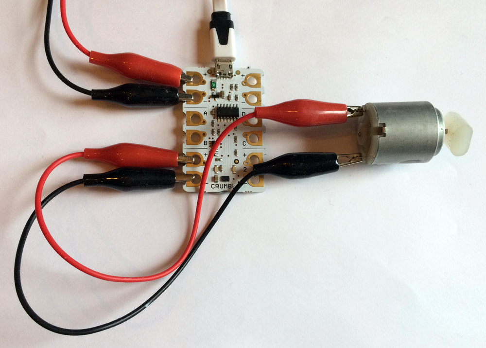
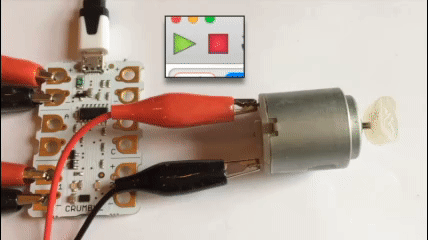
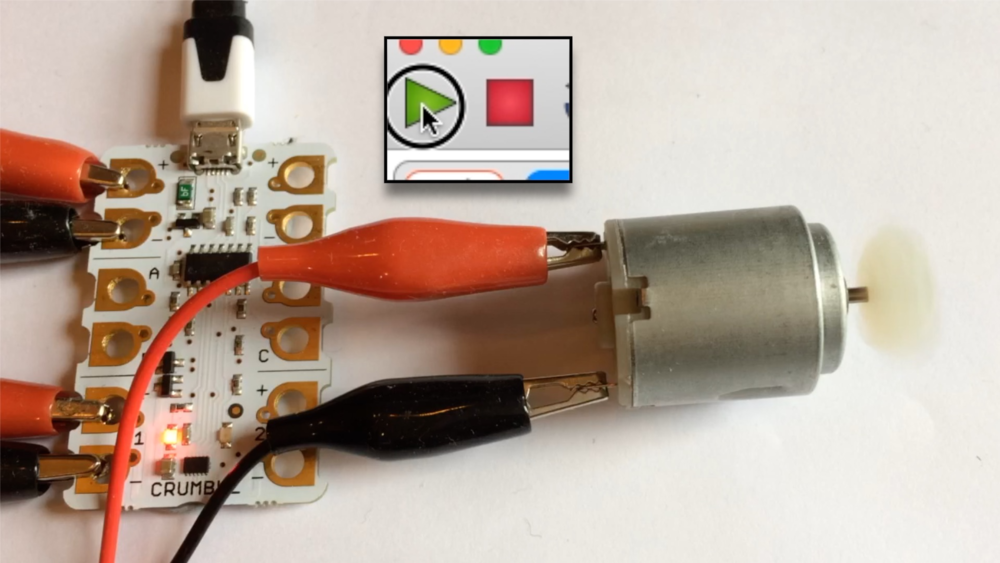

## Motors

The Crumble board is designed to be able to power two DC motors and when powered by 3 AA batteries the board outputs 4.5v to the motors.

You could use any simple standalone DC motor for this task, or a gear motor like the ones often used in making simple robot buggies. They all work the same and infact, inside the yellow casing of the gear motor shown, there is a simple DC motor just like the one on the right of the image.

Note: If you are using a 3v motor, running your motors at 70% the Crumble board will supply roughly the 3v output for which your motor was designed.

Most motors have clearly marked positive and negative terminals. If these are reversed it simply means that the motors will turn in the opposite direction.

--- task ---

The Crumble board's motor connections are the two terminals at the bottom end of the board on either side.

Connect one end of a crocodile clip the Motor 1 positive terminal (+). It is the second terminal up on the left side of the board. Connect the other end of the croc clip to the posive terminal of the DC motor. Again, this is usually marked with a '+' but if it is not clear which is the positive terminal, don't worry, just connect it to one of the two terminals.

Next, connect another croc clip from the Motor 1 negative terminal (-) to the negative terminal of the motor.

I have used red and black crocodile clips to make things clear, but any colours will work fine.

--- /task ---

Great! That's our motor connected up. Now to write our first motor controlling code!

--- task ---

As ever, let's grab a `program start`{:class="crumblebasic"} block to start our code.

Making the motor run is an output so let's look in the `Input/Output`{:class="crumbleinputoutput"} blocks palette for our motor control blocks. Can you see the one we need?

Grab the `motor 1 FORWARD at 75%`{:class="crumbleinputoutput"} block and connect it under the `program start`{:class="crumblebasic"} block.

Just so we don't have the motor jumping all over the table, let's change the power percentage to 25% to start with. Although jumping motors can be fun too!

Now click the green 'run' triangle to test your code.

--- no-print ---

--- /no-print ---

--- print-only ---

When the 'run' button is pressed, the motor will spin. When the red 'stop' square is pressed the program ends and the motor will stop.

--- /print-only ---

--- /task ---