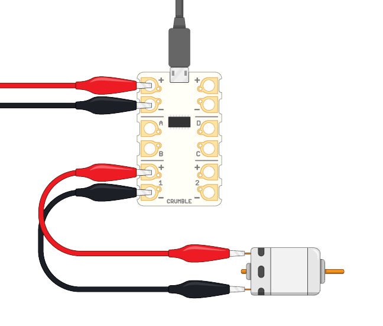
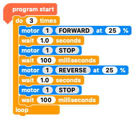

## Use DC motors with your Crumble

The Crumble board can power two DC motors. If you connect the Crumble to three AA batteries, the board outputs 4.5V to the motors.

Here, you can use any simple DC motor, or a gear motor like the ones often used in simple robot buggies. These motors all work the same. In fact, inside the yellow casing of the gear motor shown below, there is a simple DC motor just like the one on the right in the image.

**Note**: If you are using a 3V motor, then make your Crumble run it at 70%. Then the Crumble will supply roughly the 3V the motor needs.

Most motors have clearly marked positive and negative terminals. If you reverse your motor's terminals when you connect it to the Crumble, the motor will turn in the opposite direction.

--- task ---

The Crumble board's motor connections are the two times two terminals at the bottom end of the board. The two terminals on the left are labeled with **1**, and the two on the right are labeled with **2**.

* Take a cable with crocodile clips.

* Connect one crocodile clip to the Crumble's motor 1 positive terminal (+), which is the second terminal up on the left side.

* Connect the cable's other crocodile clip to the positive terminal of the DC motor. This terminal might be marked with a +, but if it is not, just connect the crocodile clip to one of the two terminals.

*  In the same way, connect another cable with crocodile clips to the Crumble's motor 1 negative terminal (1) and the negative terminal of the motor.

The images show a red for the positive connection and a black cable for the negative connection, but any colours will work fine.

--- /task ---

Great! Your motor is connected, and you can now write your first motor-controlling program!

--- task ---

As always, use a `program start`{:class="crumblebasic"} block to start your code.

* Making the motor run is an **output**. Look in the `Input/Output`{:class="crumbleinputoutput"} blocks menu for the motor control blocks. Can you see the one you need?

* Grab the `motor 1 FORWARD at 75%`{:class="crumbleinputoutput"} block, and connect it below the `program start`{:class="crumblebasic"} block.

* Change the power percentage to **25%**.

* Now click on the green triangle **play** button to test your code.

--- no-print ---

--- /no-print ---

--- print-only ---

When you click on the green triangle **play** button, your program runs and the motor spins. When you click the red square **stop** button, your program ends and the motor stops.

Tip: Stick something on the end of the motor shaft to make it much easier to tell whether the motor is spinning.

--- /print-only ---

--- /task ---

Instead of clicking the **stop** button, you can also stop the motor using code.

* Click on the `FORWARD`{:class="crumbleinputoutput"} part of the `motor 1 FORWARD at 25%`{:class="crumbleinputoutput"} block to toggle between `FORWARD`{:class="crumbleinputoutput"}, `REVERSE`{:class="crumbleinputoutput"}, and `STOP`{:class="crumbleinputoutput"}.
 
 --- no-print ---

--- /no-print ---

--- print-only ---

--- /print-only ---

Now create a program to tell the motor to go forward, then stop, go in reverse, then stop, and does all of that three times!

--- task ---

Build on the program you already have.

* Go to the `Control`{:class="crumblecontrol"} blocks menu and drag out a `wait 1.0 seconds`{:class="crumblecontrol"} block.

* Add the new block below the `motor 1 FORWARD at 25%`{:class="crumbleinputoutput"} block.

* Get another `motor`{:class="crumbleinputoutput"} block and toggle the direction so it becomes a `motor 1 STOP`{:class="crumbleinputoutput"} block.

* Add the new block below the `wait`{:class="crumblecontrol"} block.

* Next, add a `wait 100 milliseconds`{:class="crumblecontrol"} block below the `motor 1 STOP`{:class="crumbleinputoutput"} block.

Note: A `wait 100 milliseconds`{:class="crumblecontrol"} block and a `wait 0.1 seconds`{:class="crumblecontrol"} block do exactly the same thing.

The code you have now makes the motor spin forward and then stop. The next section of code you need is the same, expect it should make the motor spin in reverse. The quickest way to create this code is to copy the blocks you already have.

 --- no-print ---

--- /no-print ---

--- print-only ---

--- /print-only ---

* Right-click on the `motor 1 FORWARD at 25%`{:class="crumbleinputoutput"} block and choose **Duplicate**. This copies that blocks and the three blocks below.

* Connect the copied blocks under the code you already have.

* Toggle the `motor 1 FORWARD at 25%`{:class="crumbleinputoutput"} so it reads `motor 1 REVERSE at 25%`{:class="crumbleinputoutput"}.

* Now get a `do 10 times`{:class="crumblecontrol"} loop block.

* Put all the code blocks **except** the `program start`{:class="crumblebasic"} block inside this loop.

* Change the number of repeats from 10 to 3.

Your code should now look like this:

Now run your code and check that it does what you expect.

 --- no-print ---

--- /no-print ---

--- print-only ---

The motor should run forwards, stop, reverse, stop, and do this three times in total.

--- /print-only ---

--- /task ---