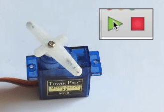

## Position servos

For this section you will need a servo and leads to connect your servo to the Crumble controller. Servos come with three wires ending in a female [type] socket. 

There are a number of ways that you could connect this to your Crumble. Two easy ways would be using male to male jumper cables between the servo plug and croc clips, or using a Crumbliser connector (shown below)

If you do not have the components needed, you can simply skip this section and the following challenge. Missing this section and its challenge will not affect any of the sections that follow.

Unlike DC motors that simply turn at varying speeds, we send information to a position servo telling it to rotate to a certain position. Most servos have a rotation range of 0° to 180°. The Crumble software uses this range as -90° to 90°.

Note: While most servos are position servo, you also get almost identical looking rotation servos that rotate in either direction in the same way that a DC motor does.

--- task ---

Connect your servo to your Crumble using the steps below according to what components you have available.

??? --- servo to Crumbliser to Crumble ---> ingredient ???
??? --- servo to jumper to croc to Crumble ---> ingredient ???

--- /task ---

Now we have the servo connected, lets code the servo to move.

--- task ---

Let's start with the `program start`{:class="crumblebasic"} block and add a `servo A 0 degrees`{:class="crumbleinputoutput"} block from the `Input/Output`{:class="crumbleinputoutput"} palette.

That's enough to get our servo to work in the most basic way. Click on the green 'play' button to move the servo to 0 degrees which is right in the middle of its range.

--- no-print ---

--- /no-print ---

--- print-only ---

--- /print-only ---

--- /task ---

Note: Make sure your code references the same terminal that you attached the signal cable to, e.g. if you connected your servo's signal wire (usually white or orange) to your Crumble's terminal A then your code block must say `servo A`{:class="crumbleinputoutput"}, otherwise that Crumble will not be talking to the servo!

Of course, if your servo was already in position 0 degrees, you will not see any movement. Let's add another position to our code to make sure we see some movement.

--- task ---

First, change the `0`{:class="crumbleinputoutput"} of your `servo A 0 degrees`{:class="crumbleinputoutput"} block to `-90`{:class="crumbleinputoutput"}.

Add another `servo A 0 degrees`{:class="crumbleinputoutput"} block to the bottom of your code, and change the `0`{:class="crumbleinputoutput"} to `90`{:class="crumbleinputoutput"}.

Of course the servo will need time to move between -90° and 90° so we neeed to add a `wait`{:class="crumblecontrol"} block between the two `servo A position`{:class="crumbleinputoutput"} blocks. Let's make it a half second delay, or `wait 0.5 seconds`{:class="crumblecontrol"}.

Click on the green 'play' button to see you servo move to 0° and then to 180° positions.

--- no-print ---

--- /no-print ---

--- print-only ---

--- /print-only ---

--- /task ---

