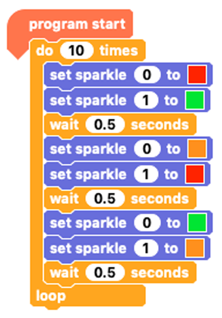
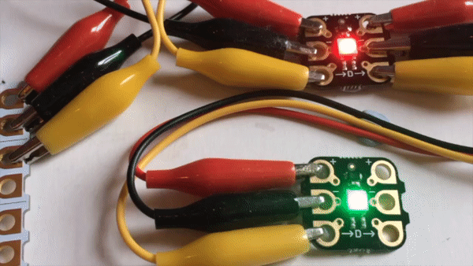

## Challenge: Follow me colour sequence

Using the code above, `sparkle 0`{:class="crumblesparkles"} will flash from red, to amber, to green, back to red and so on. `sparkle 1`{:class="crumblesparkles"} flashes the colour that was just on `sparkle 0`{:class="crumblesparkles"}.

Can you rearrange the code and add any extra blocks if needed to make `sparkle 1`{:class="crumblesparkles"} show `sparkle 0's`{:class="crumblesparkles"} colour BEFORE it changes to the next colour in the sequence?

--- hints ---

--- hint ---

The finished code will look like this when you run it.

--- /hint ---

--- hint ---

The Sparkles never change at the same time so you will need to add extra `wait`{:class="crumblecontrol"} blocks to separate all the `set sparkle to`{:class="crumblesparkles"} blocks.

You will also need to rearrange the `set sparkle 1 to`{:class="crumblesparkles"} blocks so that they match the `set sparkle 0 to`{:class="crumblesparkles"} blocks.

--- /hint ---

--- /hints ---