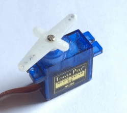
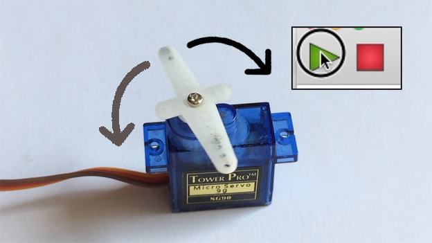
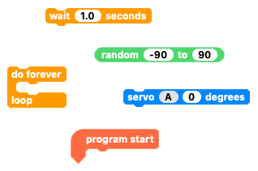
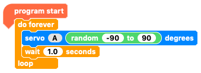

## Challenge: make a random position generator for your servo

Can you write code to make your servo keep moving to random positions?

Remember that the servo needs a little time to get to each position.
--- no-print ---

--- /no-print ---

--- print-only ---

--- /print-only ---

--- hints ---

--- hint ---

Try and write code so that:
1. When the `program starts`{:class="crumblebasic"}
1. `your servo`{:class="crumbleinputoutput"} will
1. `always`{:class="crumblecontrol"}
1. Go to a `random`{:class="crumblemaths"} `position`{:class="crumbleinputoutput"}
1.  `wait half a second`{:class="crumblecontrol"}
1. And then go to another `random`{:class="crumblemaths"} `position`{:class="crumbleinputoutput"}
1. And do this over and over.

--- /hint ---

--- hint ---

You need to use the blocks shown below to create the random position code. Can you rearrange them to make the code work?

--- /hint ---

--- hint ---

* Arrange the code blocks like this to make the code below:

* Click on the green triangle **play** button to run your code.

Does the motor do what you expect?

--- /hint ---

--- /hints ---
