## Button switches

The Crumble starter kit come with a great little Crumble friendly button switch but you could use any switch as long as you can connect to the switches terminals.

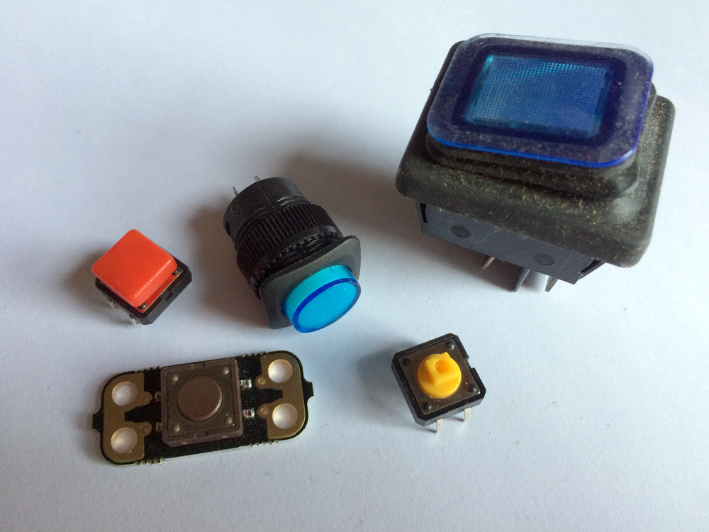

Note: different switches work in different ways. We mostly think of switches as standard on/off switches but some are push to make (when you press them the switch is on but as soon as you stop pressing, the switch is off) and some are even push to break (on unless being pressed). The Crumble starter kit button switch is push to make.

All of the components that we have looked at so far have been outputs. The Crumble has sent information out to them and they have done something in response. The button switch is the opposite. It is an input which means something happens outside, i.e. someone presses the button switch, and the Crumble recieves that information. The switch is either on or off.

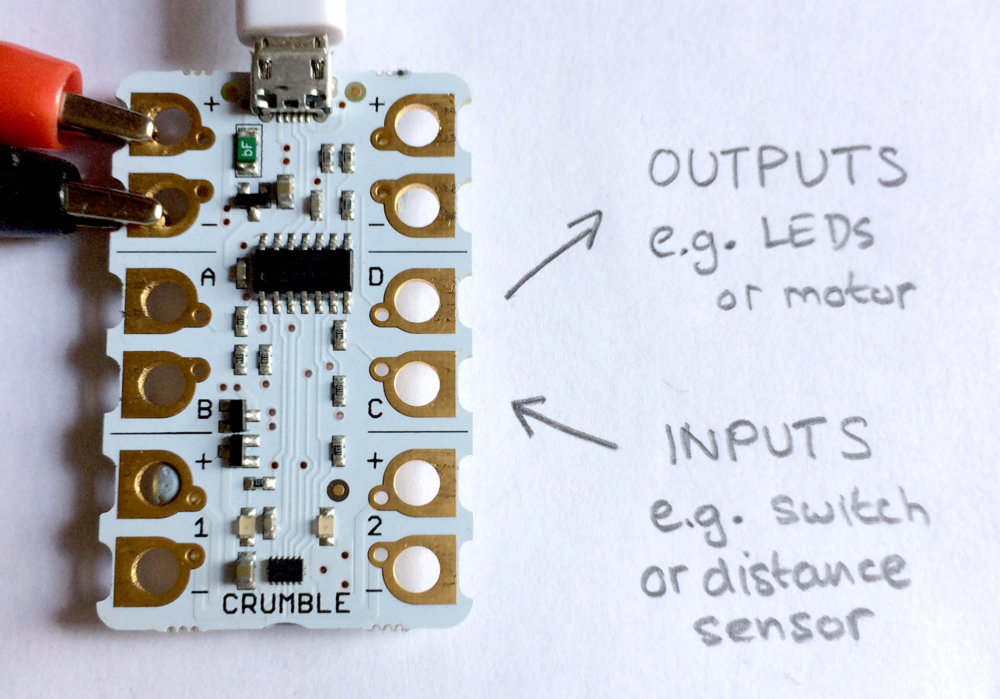

Let's connect up our switch.

--- task ---

First, let's connect positive power to the switch. Connect a croc clip from the positive (+) terminal of the Crumble at the top right corner to one side of the Crumble button switch (either side will do).

Next, we connect another croc clip from terminal A to the other side of the Crumble button switch. You could also use terminals B, C or D for switches.

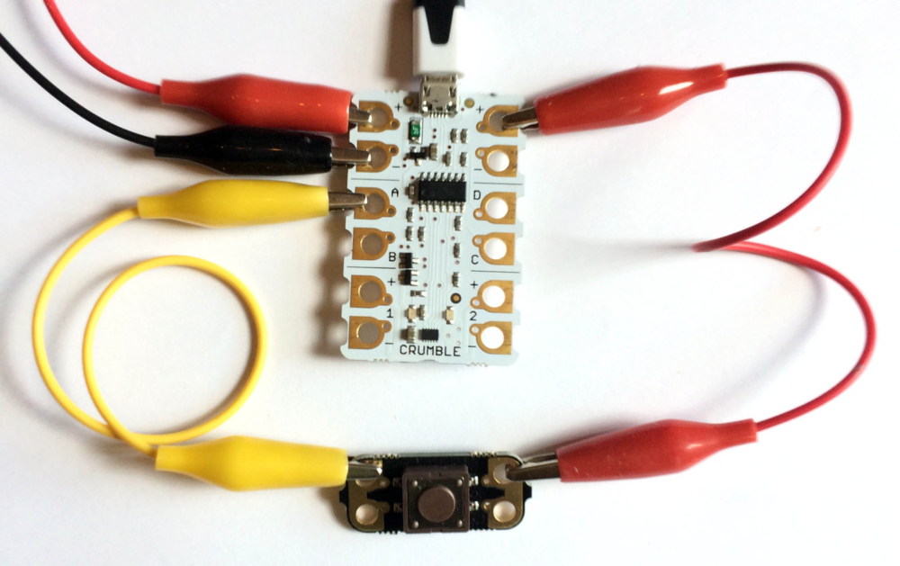

--- /task ---

Now that it is connected, when the button is pressed terminal A is HI (on), and when the button is released terminal A is LO (off).

And now let's write some code.

--- task ---

As ever, we start with the `program start`{:class="crumblebasic"} block.

Next, we need to ask a question about what state the button is in. Is the button in its on or off state?

from the `control`{:class="crumblecontrol"} palette, grab the `if... then`{:class="crumblecontrol"} block.

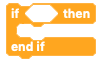

From the `Input/Output`{:class="crumbleinputoutput"} block palette, get an `A is HI`{:class="crumbleinputoutput"} block and place it inside the hexagonal space in the `if... then`{:class="crumblecontrol"} block.

--- no-print ---

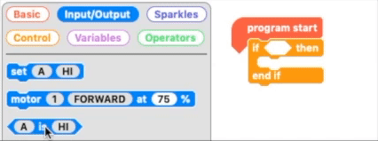

--- /no-print ---

--- print-only ---

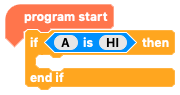

--- /print-only ---

That's great but at the moment, the program only checks `if`{:class="crumblecontrol"} the button is being pressed at the moment the program starts. We want it to keep on checking so we need to put our `if`{:class="crumblecontrol"} statement, our conditional statement, in a `do forever`{:class="crumblecontrol"} loop so that it checks the button the whole time the program is running.

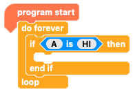

--- /task ---

Of course, we now need an output for the Crumble to be able to indicate the result of the input, or whether the switch is on or off.

You can use any input for this depending on your project, but for now, let's use a motor. If you don't have a motor to hand feel free to use any other input.

--- task ---

Connect up a DC motor as we did earlier in the project. This project example uses motor output 2 on the bottom right-hand side of the Crumble.

[[[connect-motor-crumble]]]

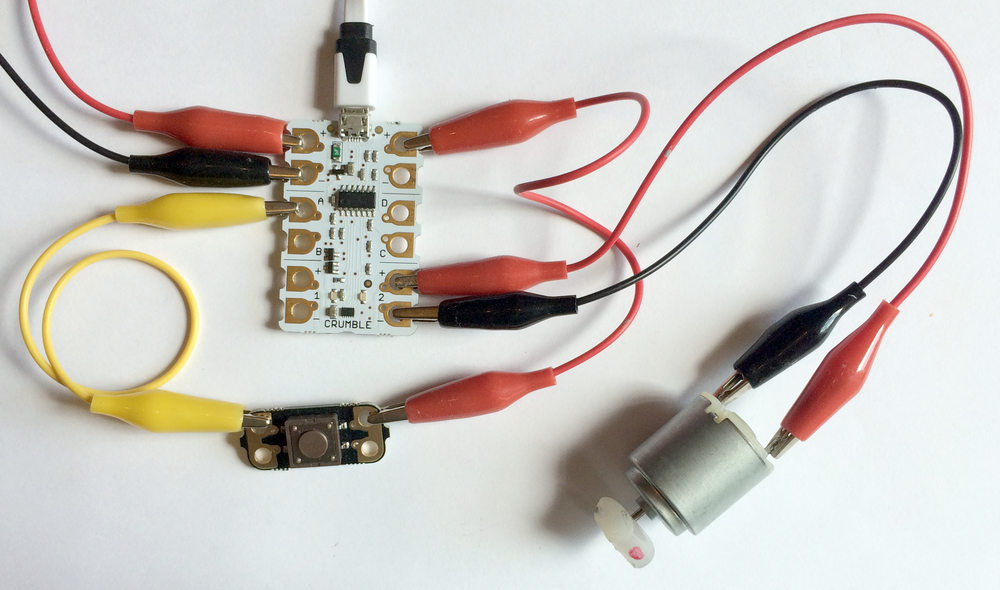

Now let's get our DC motor output going by adding some code.

Inside the conditional statement, add `motor 2 FORWARD at 50%`{:class="crumbleinputoutput"} from the `Input/Output`{:class="crumbleinputoutput"} palette.

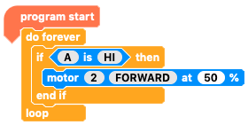

Now our code reads, when the `program starts`{:class="crumblebasic"}, `if`{:class="crumblecontrol"} `the switch is on`{:class="crumbleinputoutput"} `then`{:class="crumblecontrol"} `turn motor output 2 on at 50% speed`{:class="crumbleinputoutput"}. 

Click the green 'play' button to see what happens. Was it what you expected?

--- no-print ---

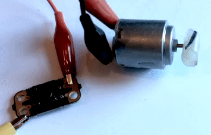

--- /no-print ---

--- print-only ---

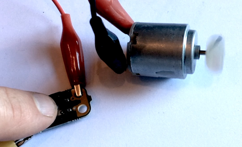

--- /print-only ---

--- /task ---

At the moment, if the switch is off then the motor is not being told it to do anything so when we stop pressing the button switch the motor will keep on going.  Let's fix that!

--- task ---

Start by pulling the `if... then`{:class="crumblecontrol"} block out of the `do forever`{:class="crumblecontrol"} loop. Now get a `if... then... else`{:class="crumblecontrol"} block and place that inside the `do forever`{:class="crumblecontrol"} loop instead.

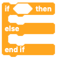

The first gap, after the `then`{:class="crumblecontrol"} tells the Crumble what to do if the condition, e.g. `A is HI`{:class="crumbleinputoutput"} is true (the button is being pressed) while the second gap, after the `else`{:class="crumblecontrol"} tells the Crumble what to do if the condition is not true (the button is not being pressed).

Take the blocks out from the `if... then`{:class="crumblecontrol"} block we were using and put them in our new `if... then... else`{:class="crumblecontrol"} block.

Now add a new instruction in the gap under `else`{:class="crumblecontrol"} saying `motor 2 STOP`{:class="crumbleinputoutput"}.

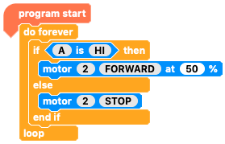

Try clicking the green 'play' button and see what happens. When the button is pressed the motor should run but then stop as soon as the button is released.

--- no-print ---

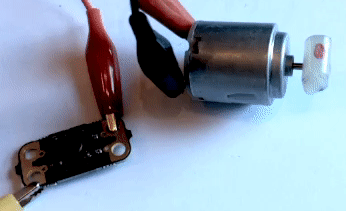

--- /no-print ---

--- print-only ---

--- /print-only ---

--- /task ---

Congratulations! You have now connected a range of components to your Crumble and written code for each! Now that you know all that, what will you make next?

