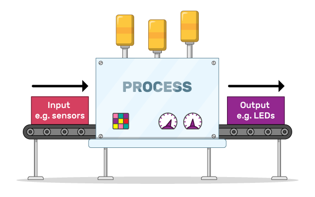
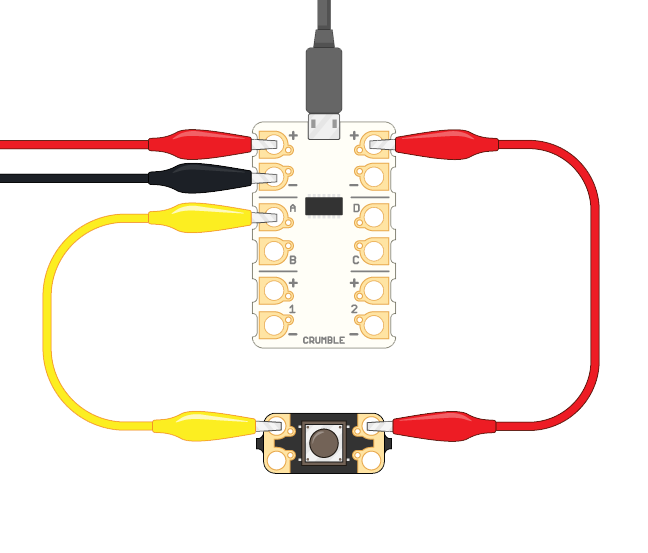
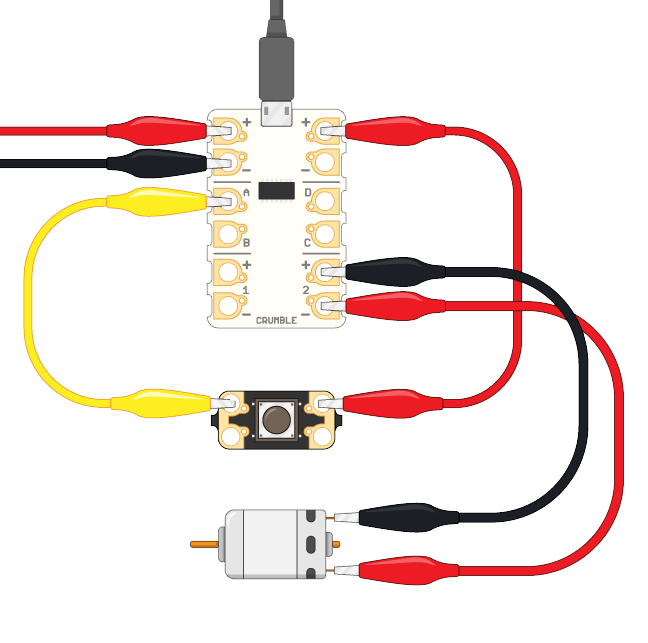

## Use buttons with your Crumble

What you will need for this step:

* Either the Crumble-friendly button from the Crumble starter kit
* Or any button that you can connect to the Crumble's switches terminals

**Note:** Different buttons work in different ways:

* There are standard on/off buttons
* Some buttons are 'push to make' buttons, meaning you need to push them and hold them down to make something happen
* Some buttons are 'push to break' buttons, meaning you have to push them and hold them down to stop something happening

The Crumble starter kit button is a 'push to make' button.

All of the components in the previous steps are **outputs**. That means the Crumble sends information out to them, and they do something in response.

The button is an **input**, which means it sends information to the Crumble. The information the button sends is whether it is pushed or not.

Now connect your button.

--- task ---

First, connect positive power to the button.

* Take a crocodile clip cable and connect it to the positive (+) terminal of the Crumble at the top right-hand corner and the button (either side of the button works).

* Next, connect another crocodile clip cable from the Crumble's terminal A to the other side of the button.

You could also use terminals B, C, or D for connecting buttons.

--- /task ---

When you push the button, terminal A is HI, meaning it's on. When you release the button, terminal A is LO, meaning it's off.

Now write some code.

--- task ---

* As always, start with the `program start`{:class="crumblebasic"} block.

Next, your code needs to check whether the button in its on or off state.

* From the `control`{:class="crumblecontrol"} blocks menu, drag out the `if...then`{:class="crumblecontrol"} block. Connect the new block to your first block.

* From the `Input/Output`{:class="crumbleinputoutput"} blocks menu, get an `A is HI`{:class="crumbleinputoutput"} block and place it inside the hexagonal space in the `if...then`{:class="crumblecontrol"} block.

--- no-print ---

--- /no-print ---

--- print-only ---

--- /print-only ---

At the moment, your code only checks `if`{:class="crumblecontrol"} the button is in its on or off state at the moment the program starts. You want it to keep on checking so you need to put your `if`{:class="crumblecontrol"} statement into a `do forever`{:class="crumblecontrol"} loop.

Then the code checks the button the whole time.

--- /task ---

You now need to add an output so the Crumble can show what the input is. Here the input is whether the button is in its on or off state.

You can use any output for this you want, but for now, use a motor. If you don't have a motor, do use any other input.

--- task ---

Connect a DC motor as before. The example below uses motor output 2 on the bottom right-hand side of the Crumble.

[[[connect-motor-crumble]]]

--- /task ---

Now get your DC motor output moving by adding some more code.

--- task ---

From the `Input/Output`{:class="crumbleinputoutput"} menu, drag a `motor 2 FORWARD at 50%`{:class="crumbleinputoutput"} and add it inside the `if`{:class="crumblecontrol"} block

Now your code reads
1. When the `program starts`{:class="crumblebasic"}
1. `if`{:class="crumblecontrol"} `the button is on`{:class="crumbleinputoutput"}
1. `Then`{:class="crumblecontrol"} `turn motor output 2 on at 50% speed`{:class="crumbleinputoutput"}

Click on the green triangle **play** button and see what happens.

--- no-print ---

--- /no-print ---

--- print-only ---

--- /print-only ---

--- /task ---

At the moment, if the button is in its off state, then the motor is not being told to do anything. So when you stop pressing the button, the motor keeps moving.

--- task ---

Add code so that the motor stops moving when you don't push the button.

* Pull the `if... then`{:class="crumblecontrol"} block out of the `do forever`{:class="crumblecontrol"} loop
* Get an `if... then... else`{:class="crumblecontrol"} block and place that inside the `do forever`{:class="crumblecontrol"} loop instead

Between the `if`{:class="crumblecontrol"} and `then`{:class="crumblecontrol"} is the test the block runs. The test here is `A is HI`: is the button being pushed?

The first gap, after the `then`{:class="crumblecontrol"}, says what happens if the button is being pushed.

The second gap, after the `else`{:class="crumblecontrol"} says what happens if the button is **not** being pushed.

Take the blocks out from the `if... then`{:class="crumblecontrol"} block and put them in your new `if... then... else`{:class="crumblecontrol"} block.

Now in the gap after`else`{:class="crumblecontrol"}, add a new instruction saying `motor 2 STOP`{:class="crumbleinputoutput"}.

Click on the green triangle **play** button and see what happens.

When you push the button now, the motor should run, and when you release the button, the motor should stop.

--- no-print ---

--- /no-print ---

--- print-only ---

--- /print-only ---

--- /task ---

Congratulations!

Now you know how to connect a range of components to your Crumble, and how to write code to control the components.

Congratulations!

What will you make next?

